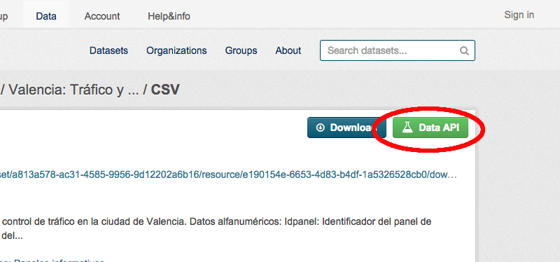

Introduction
------------

This operator allows you to use any [CKAN][ckan] dataset stored in the DataStore as a source of data.

Settings
--------

Preferences that you should consider:

* **CKAN Server URL**: The link to the CKAN instance where the resource is stored (https://data.lab.fiware.org by default).
* **CKAN Authorization Token**: CKAN Authorization Token. If empty, this operator will use the IdM credentials of the current user (only available for users logged through the IdM server, so will not work for anoymous users/public workspaces).
* **Resource ID**: The resource identifier.
* **Number of rows to retrieve (resources)**: The number of records to retrieve. By default, 100 records are retrieved. This cannot be enough for large resource. If you want to retrieve more that 100 records, you must edit this setting.

Obtaining a resource ID
-----------------------

1. Look for a dataset of your interest.
2. Open the details page of the resource you want to use from the dataset and check it can be used through the "Data API":

    

3. Scroll down the details page and click "Show more" in the "Additional Information" section.
4. Copy the id field :):

    

**Note:** Currently, only CSV resources can be used through the "Data API".

References
----------

* [FIWARE Lab's Data portal](https://data.lab.fiware.org)
* [CKAN][ckan]

[ckan]: http://ckan.org/
